# Interpreting the Frontal Cortex PCA Example

This document explains the example PCA plots in `assets/frontal_cortex_pca/`.

## Big Picture

The PCA was run inside a grouped frontal cortex dataset. The main question is:

> What is the biggest structure in the data before fitting differential-expression models?

The scree plot shows:

- PC1 explains about 34.4%
- PC2 explains about 13.7%
- together, PC1 and PC2 explain about 48.1%

So the PC1-PC2 view shows a large part of the dominant variation.

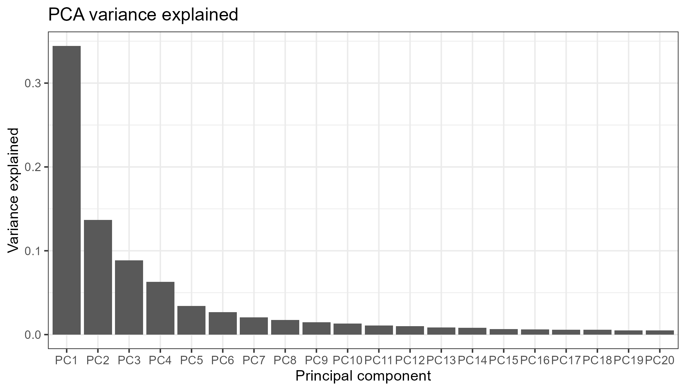

How to read this image:

- The x-axis lists PCs.
- The y-axis shows how much variation each PC explains.
- PC1 is the tallest bar, so it is the biggest source of variation.
- PC2 is smaller but still important.
- Later PCs explain less variation one by one.

## First Rule: PCA Is Exploratory

PCA does not prove that a variable is significant. It shows visible structure.

Good PCA language:

> Samples appear to separate by original region.

Too strong:

> PCA proves original region causes the difference.

PCA helps decide what to check and what to include in the downstream model.

## BrainArea

The `BrainArea` plot is not very informative because all samples are labeled `Frontal_Cortex`.

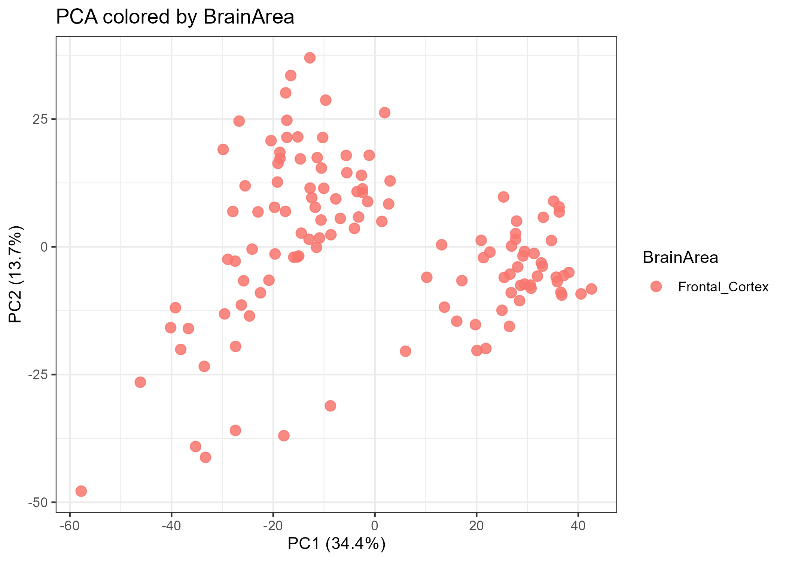

This means the PCA is already inside one broad brain-area subset. Since there is only one broad `BrainArea`, it cannot explain differences among points.

## OriginalRegion

This is the most important plot.

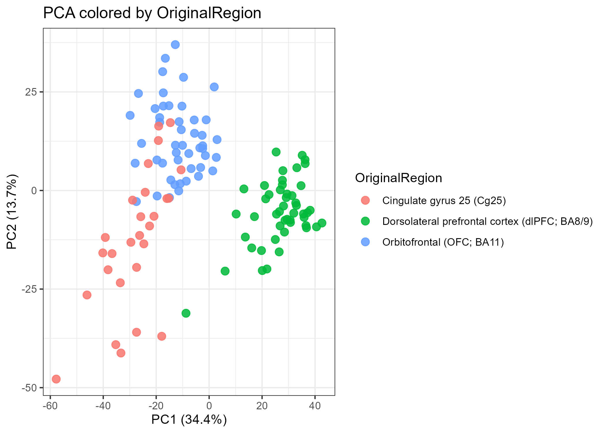

The grouped frontal cortex data still contains multiple original regions:

- Cg25
- dlPFC
- OFC

These regions separate clearly in PCA space.

Interpretation:

> The exact original frontal region is a major source of expression variation.

Modeling consequence:

> Include `OriginalRegion` as a covariate when analyzing grouped frontal cortex samples.

Without region adjustment, a model could confuse a region difference with a diagnosis difference.

Plain-language example:

> If a gene is naturally higher in OFC than dlPFC, and MDD samples are not perfectly balanced across those regions, the model might accidentally call a region effect a diagnosis effect.

## Diagnosis

CTRL and MDD are mixed across the PCA plot.

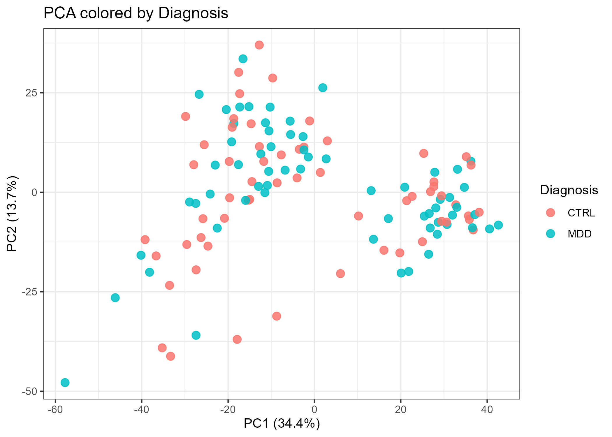

Interpretation:

> Diagnosis is not the largest global source of variation.

This does not mean diagnosis has no effect. In transcriptomics, disease effects can be gene-specific and subtle. PCA only shows the largest global patterns.

Modeling consequence:

> Keep `Diagnosis` in the model because it is the target variable, but do not expect PCA alone to identify depression genes.

This is common in transcriptomics. Disease effects can be real but subtle, affecting specific genes rather than moving every sample into a separate PCA cluster.

## Age

Age does not appear to define the main clusters in PC1-PC2.

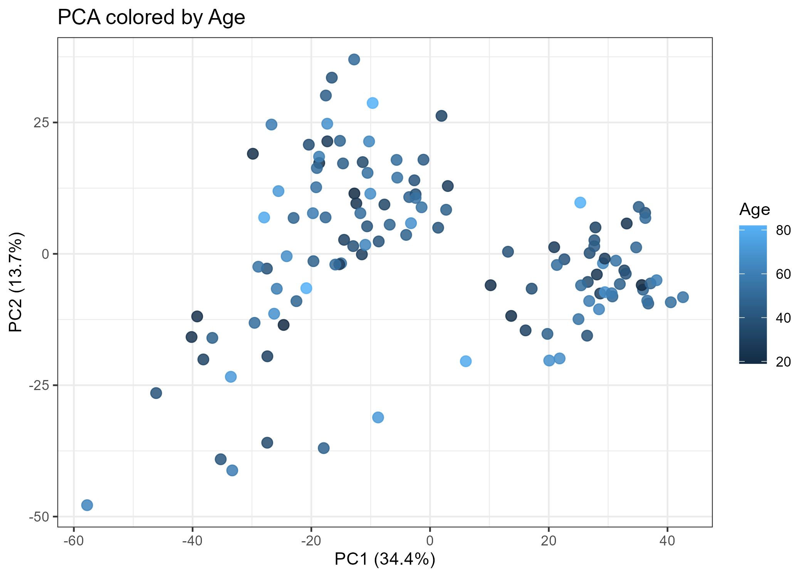

Interpretation:

> Age may matter biologically, but it is not visually dominating the first two PCs.

Modeling consequence:

> Age is still reasonable to include as a covariate.

## Sex

Male and female samples appear mixed.

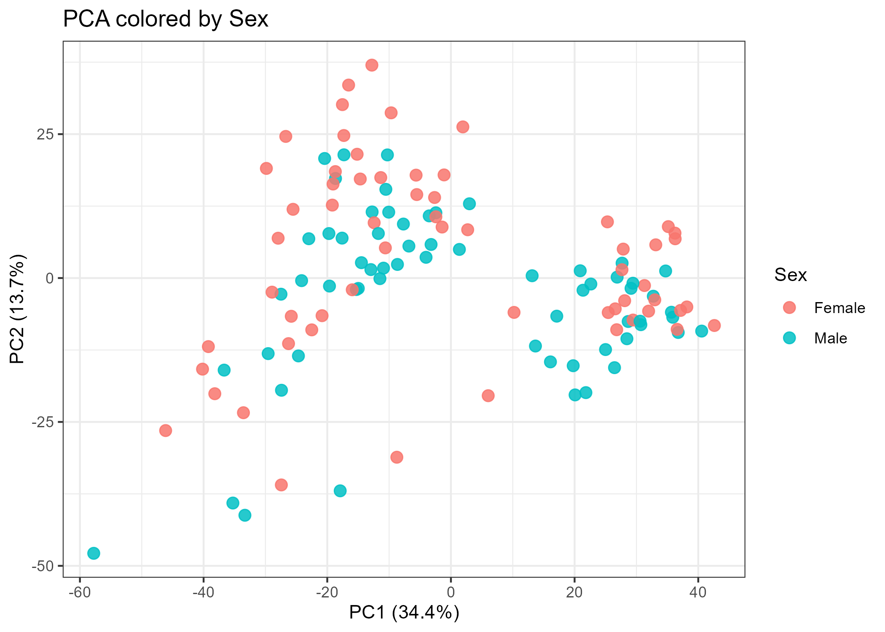

Interpretation:

> Sex does not appear to dominate PC1-PC2.

Modeling consequence:

> Sex can remain a covariate because expression often differs by sex, even when the PCA signal is not dramatic.

## RIN

RIN shows no obvious giant separation in PC1-PC2.

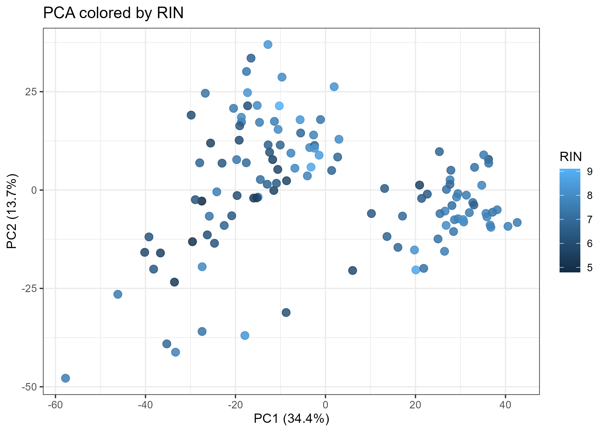

Interpretation:

> RNA quality may influence expression, but it is not the strongest visible driver in the first two PCs.

Modeling consequence:

> RIN is still a sensible technical covariate.

## PMI

PMI does not visibly define the main PCA clusters.

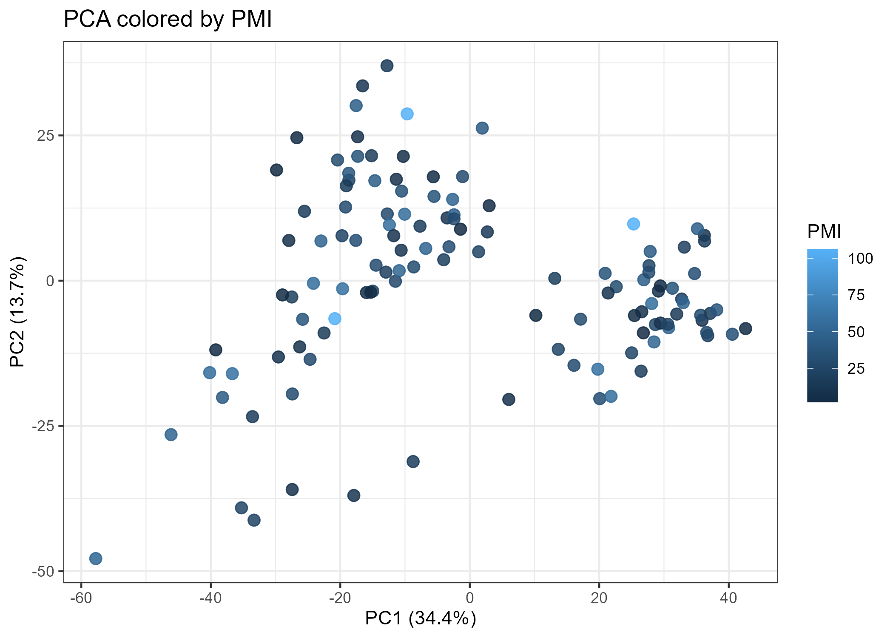

Interpretation:

> PMI is not the dominant visible source of PC1-PC2 variation.

Modeling consequence:

> Consider PMI if metadata quality is good and missingness is acceptable.

## pH

pH does not show a strong global gradient in PC1-PC2.

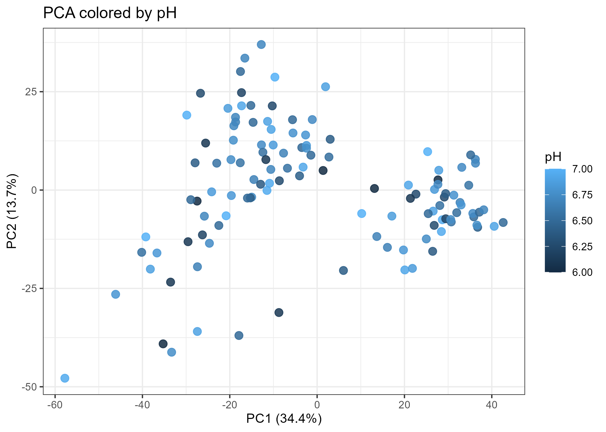

Interpretation:

> pH may matter, but it is not visually dominating the first two PCs.

Modeling consequence:

> Consider pH as a covariate if it is reliable and does not destabilize the model.

## Recommended Starting Model

For grouped frontal cortex, a reasonable first mixed model is:

```text
expression_gene ~ Diagnosis + Age + Sex + RIN + OriginalRegion + (1 | BrainID)
```

Possible additions:

```text
expression_gene ~ Diagnosis + Age + Sex + RIN + PMI + pH + OriginalRegion + (1 | BrainID)
```

Choose the final formula after checking missingness, collinearity, sample size, and model stability.

## How the Covariate Heatmap Helps

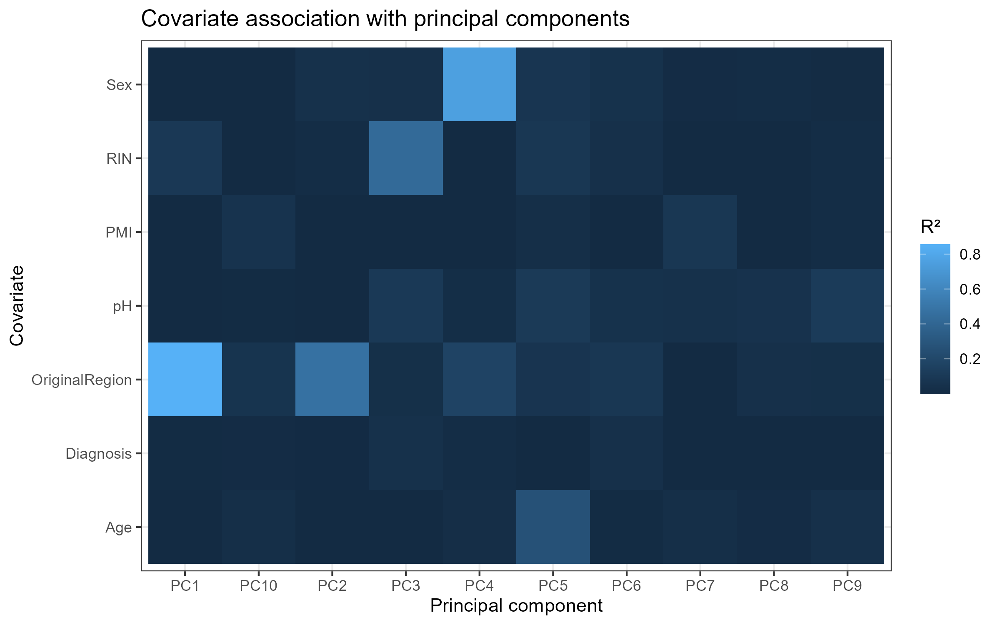

The PCA scatter plots show patterns visually. The heatmap makes the same idea more systematic.

Each cell asks:

> How much of this PC is associated with this covariate?

Bright cells mean stronger association. Dark cells mean weaker association.

In this example, `OriginalRegion` has a strong relationship with the early PCs, especially PC1 and PC2. That supports the visual interpretation from the original-region PCA plot.

## Covariate Balance

Before fitting a model, also check whether diagnosis groups are balanced across regions and technical variables.

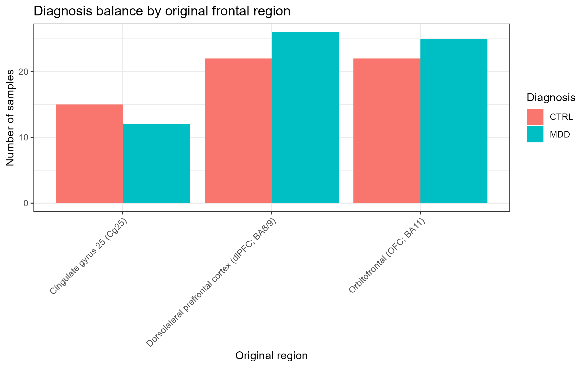

The diagnosis-by-region plot checks whether CTRL and MDD samples are distributed similarly across Cg25, dlPFC, and OFC.

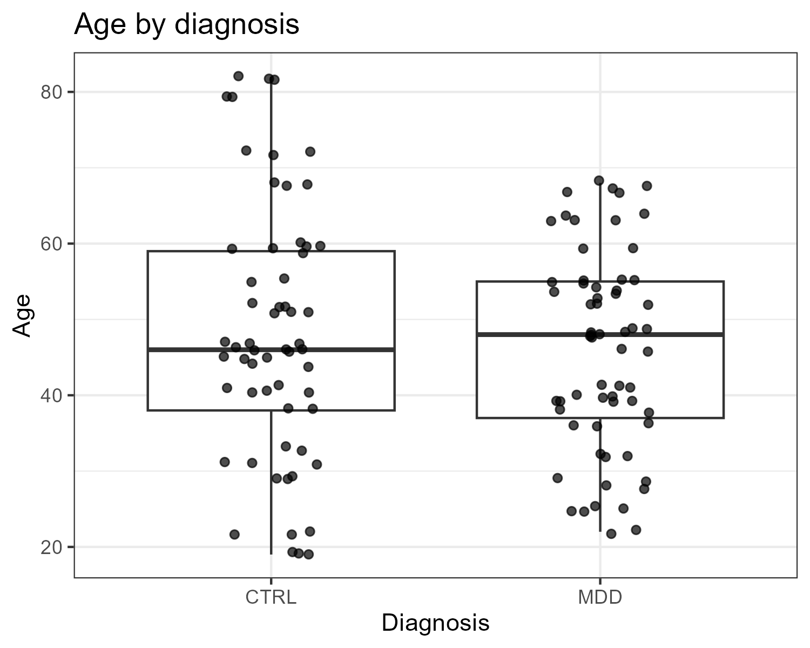

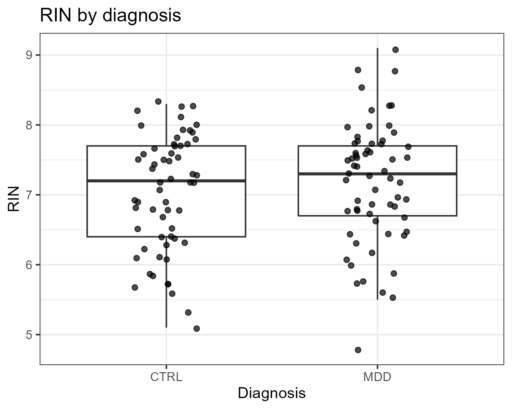

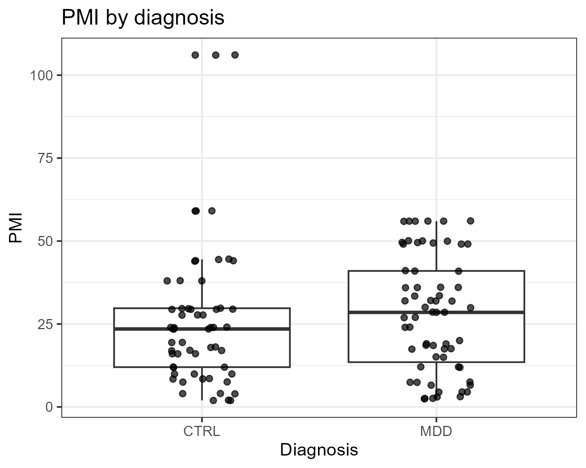

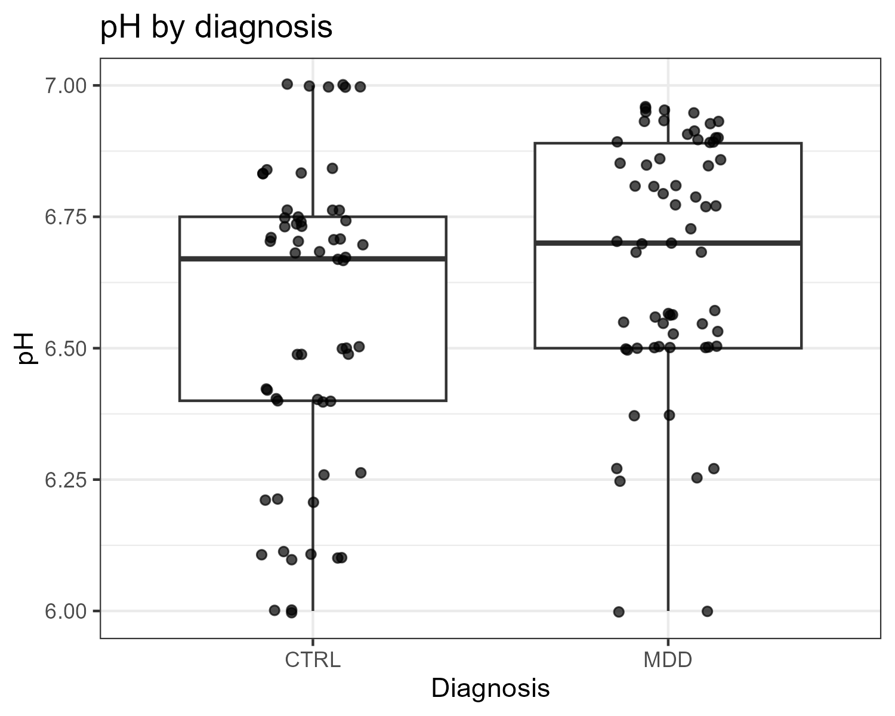

These boxplots ask whether diagnosis groups differ in age, RNA quality, postmortem interval, or pH. If they differ strongly, those variables become more important to control for.

## Main Takeaway

The PCA is mainly saying:

> Grouped frontal cortex samples are still strongly structured by original region. Region should be accounted for before interpreting diagnosis effects.
